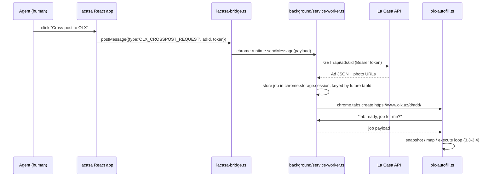

# Cross-posting — Channel Reality Check, OLX Extension, Publish Tracking

Consolidates the cross-posting design across all ad-distribution channels:
what "one-click, LLM-autofill everywhere" actually resolves to per channel,
the OLX browser-extension architecture, the unified `AdPublication` tracking
model, and Instagram's onboarding fix. Extends `05-migration-plan.md` Phase E
and adds Phase F. Full worked specs live in three companion docs and are not
repeated in full here: `07-olx-crosspost-extension.md` (extension internals,
complete code), `08-publish-tracking.md` (data model, API, JSON examples,
migration-plan diff), and `09-instagram-onboarding.md` (OAuth connect flow +
the narrower caption-only extension fallback).

## 1. Goal & reality check

The goal as stated: click one button on an Ad in La Casa, and it goes out —
LLM-filled, no manual retyping — on every channel the agency uses. That goal
is only literally true for two of four channels. It collapses differently per
channel depending on whether a server-to-server API exists at all:

| Tier | What actually happens | Channels |
|---|---|---|
| True one-click (server API) | Click → server calls a partner API with structured Ad data → done. No browser tab, no form, no LLM step (there's no form to fill — the data goes straight in) | Telegram, Instagram (Graph API, business account) |
| One-click for the user, client-side execution | Click → browser runs an OAuth-authenticated upload itself (user's own Google session) → reports the outcome back to the server | YouTube |
| LLM-assisted, human-gated | Click → extension opens the channel's own web form in the agent's own logged-in tab → LLM fills it from a live DOM snapshot → a human reviews and clicks that channel's own Publish button | OLX |
| Not possible | No API and no compliant automation path exists at all | Facebook Marketplace, Instagram native composer |

Two clarifications that matter for how this reads elsewhere in the doc:

- **"LLM-autofill" applies to exactly one channel: OLX.** Telegram and
  Instagram never had a form to autofill — the server sends already-structured
  Ad fields directly to a partner API. YouTube's upload is metadata + a file,
  not a fillable form either. The LLM-mapping machinery in §3 exists solely
  because OLX has no API and a client-rendered form that changes without
  notice.
- **OLX collapses to human-gated, not server API, for a structural reason,
  not a technical shortcut.** OLX.uz has no bulk/partner posting API for
  Uzbekistan. The only way to post without the server storing an agent's OLX
  session/credentials (a ToS and security liability) is to run inside the
  agent's own already-logged-in browser tab and require the human to click
  Publish themselves — the same thing a careful human assistant would do.
  There is no unattended/background-bot path in this design, even in
  principle (see §7).

## 2. Per-channel verdict table

| Channel | Mechanism | Automation tier | Status |
|---|---|---|---|
| Telegram | `POST /publish/telegram` — server bot token, `sendMediaGroup` | True one-click (server API) | Existing |
| Instagram (primary) | `POST /publish/instagram` — server-held agent IG Graph token, carousel publish; account connected via OAuth (`GET /auth/instagram/connect`), not a manually-pasted token | True one-click (server API) | Existing publish call; connect flow is new — see `09-instagram-onboarding.md` §1 |
| Instagram (fallback) | Browser extension fills only the caption field on `instagram.com`'s own web composer via LLM; agent picks photos and clicks Share themselves | LLM-assisted, human-gated, opt-in with explicit risk consent | New, narrower than OLX — see `09-instagram-onboarding.md` §2 |
| YouTube | Browser OAuth resumable upload (user's own Google session), then `POST /publish/youtube` report-back | Client-side one-click + report-back | Existing (report-back endpoint is new) |
| OLX.uz | Browser extension: LLM reads the live OLX form via server-side `POST /publish/olx/map-fields`, extension fills the DOM, human clicks Publish in their own tab | LLM-assisted, human-gated | New |
| Facebook Marketplace | — | Not possible | Out of scope (§5) |
| Instagram Stories/Reels, personal (non-business) accounts | — | Not possible | Out of scope (§5) — distinct from the feed-post caption fallback above, which targets the same composer surface the Graph API already publishes to |

## 3. OLX extension architecture

No server-to-server API exists for OLX in this market, so posting happens
inside the agent's own browser via a Manifest V3 extension. This section
summarizes the eight design areas; `07-olx-crosspost-extension.md` has the
complete manifest, full source sketches, and worked edge cases.

### 3.1 Extension shape

MV3, module service worker, two content scripts. `host_permissions` is
scoped to exactly three origins — no `<all_urls>`:

```json
{
  "manifest_version": 3,
  "permissions": ["storage", "scripting", "tabs"],
  "host_permissions": [
    "https://www.olx.uz/*",
    "https://olx.uz/*",
    "https://api.lacasa.uz/*",
    "https://minio.lacasa.uz/*"
  ],
  "background": { "service_worker": "background/service-worker.js", "type": "module" },
  "content_scripts": [
    { "matches": ["https://lacasa.uz/*", "https://*.lacasa.uz/*"], "js": ["content/lacasa-bridge.js"] },
    { "matches": ["https://www.olx.uz/*", "https://olx.uz/*"], "js": ["content/olx-autofill.js"] }
  ],
  "content_security_policy": { "extension_pages": "script-src 'self'; object-src 'self'" }
}
```

Chrome Web Store policy (and MV3 itself) forbids fetching and `eval`-ing
remote code — everything the extension runs ships in the packaged bundle. The
LLM call (§3.3) therefore returns **data only** (a JSON field-map), never a
script: the executor is fixed, bundled code interpreting that JSON against a
closed action vocabulary (§7), so the model cannot inject behavior beyond
"fill this field with this value."

### 3.2 Trigger flow

`postMessage` handshake, not `externally_connectable`: a page can't message
an extension directly unless the extension allow-lists the page's origin,
which would hardcode the extension ID into the web bundle per environment and
widen the extension's attack surface to any script that ever runs on
`lacasa.uz` (e.g. an XSS bug), not just the app's own bundle. `postMessage` +
a same-origin content-script relay keeps the extension's only entry point
scoped and lets the extension ID change freely.



The background worker re-fetches the canonical Ad JSON itself rather than
trusting whatever the page sent beyond `adId`/`token` — keeps the job
authoritative and picks up current photos even if the page's in-memory state
is stale. The job is stored in `chrome.storage.session` (not a worker-local
variable) because MV3 service workers are killed and respawned constantly;
in-memory state does not survive that.

### 3.3 Field-mapping mechanism

`content/dom-snapshot.ts` walks the form scoped to the current step and
produces a compact, accessibility-tree-style array — labels, roles, current
values, option lists — deliberately not `outerHTML`, to keep the payload
small and strip layout noise. Every kept element gets a fresh
`data-lacasa-ref` attribute, valid for this run only, never persisted or
assumed correct across a reload — the load-bearing decision for resilience
(§6): nothing hardcodes a selector against OLX's actual DOM.

```ts
type FieldNode = {
  ref: string; tag: "input" | "select" | "textarea" | "button" | "div";
  role?: string; type?: string; name?: string; id?: string;
  label?: string; placeholder?: string; value?: string;
  options?: string[]; required?: boolean; path: number[];
};
type CategoryStepNode = { ref: string; kind: "category-step"; level: number;
  options: { ref: string; label: string }[] };
```

OLX's category picker (Недвижимость → Квартиры → Продажа) is a sequence of
click-through panels, not a `<select>`, so it runs its own loop, separate
from the flat-field loop: snapshot current panel → send to the backend with
the Ad's type/category → backend LLM returns `{ categoryClick: { ref, label } }`
→ executor clicks it → a bounded `MutationObserver` (5s timeout) waits for the
next panel → repeat, or abort to the review banner on timeout. Each level is
its own fresh round trip; the backend is never asked to predict the whole
tree in one shot, since the tree's shape is exactly what can't be hardcoded.

New backend routes:

| Method & path | Access | Body | Returns |
|---|---|---|---|
| `POST /publish/olx/map-fields` | agent/coworker | `{ adId, step: "category"\|"details"\|"photos"\|"price-location", snapshot: (FieldNode\|CategoryStepNode)[] }` | `{ categoryClick?, fields: FieldAction[], unresolved: UnresolvedField[], confidence }` |
| `POST /publish/olx/confirm` | agent/coworker | `{ adId, event: "drafted"\|"published"\|"failed"\|"aborted"\|"dom-drift", externalId?, externalUrl?, errorMessage? }` | `{ publication }` — status transitions plus audit-only events; also the rate-limit/drift-telemetry signal (§3.6-3.7) |

`server/src/routes/olx.js` loads the Ad, builds a prompt from its structured
fields (title, city/district/address, type, category, rooms, area,
storey/floors, repairment, furniture, price, description, hashtags) plus the
serialized snapshot, and calls the LLM with a **strict JSON schema / tool-use
response format** so the model is structurally prevented from returning
anything but `FieldAction[]`/`UnresolvedField[]` — never a script, never free
text. The prompt explicitly forbids targeting the submit/publish control;
§3.6/§7 enforce the same rule independently on the executor side.

### 3.4 Executor

OLX's form is a React SPA. React installs change-tracking via the *native*
property setter on the DOM prototype, not the element instance — a plain
`el.value = 'x'` bypasses React's synthetic `onChange`, so form state never
updates and React may snap the visible value back on next render. Fix: call
the native setter **and** dispatch a real `input`/`change` event so React's
delegated listener observes it as a genuine edit.

```ts
function setNativeValue(el: HTMLInputElement | HTMLTextAreaElement, value: string) {
  const proto = el instanceof HTMLTextAreaElement ? HTMLTextAreaElement.prototype : HTMLInputElement.prototype;
  Object.getOwnPropertyDescriptor(proto, "value")!.set!.call(el, value);
  el.dispatchEvent(new Event("input", { bubbles: true }));
  el.dispatchEvent(new Event("change", { bubbles: true }));
}
```

Custom widgets (category picker, radio-styled toggles) get a real
`pointerdown`/`mousedown`/`mouseup`/`click` sequence instead — they're just
click handlers, not controlled inputs. Every write is read back after ~60ms;
fields where the value doesn't stick (some typeahead widgets read
`InputEvent.data`/`inputType` and ignore programmatic `.value` entirely) fall
back once to simulated per-character keystrokes (`keydown` →
`beforeinput`/`input` with `inputType: 'insertText'` → `keyup`) before being
marked unresolved.

### 3.5 Photo handling

`input.files` is read-only, so it's built via `DataTransfer`. MinIO photo
URLs are cross-origin to OLX: the **background worker** fetches each photo
(it holds `host_permissions` for the MinIO origin and gets cross-origin
`fetch` without a page's CORS context), then transfers raw bytes to the OLX
tab as an `ArrayBuffer` via `chrome.tabs.sendMessage` — structured clone
supports `ArrayBuffer` but not `Blob` reliably across extension contexts, so
`Blob` is never sent directly. The content script rebuilds a `File` locally:

```ts
async function attachPhotos(input: HTMLInputElement, photos: { buffer: ArrayBuffer; mime: string; filename: string }[]) {
  const dt = new DataTransfer();
  for (const p of photos) dt.items.add(new File([p.buffer], p.filename, { type: p.mime }));
  input.files = dt.files;
  input.dispatchEvent(new Event("change", { bubbles: true }));
}
```

Assigning `input.files` this way needs no user gesture (it's a scripted
property write, not opening the OS file picker, so Chrome doesn't gate it
behind `isTrusted`). The extension *can't* drive OLX's native file-picker
dialog through OS chrome — it doesn't need to, since `DataTransfer` bypasses
the dialog entirely. Photos transfer in small batches (3-4 at a time, not all
10-20 at once) to keep message payloads bounded and failures isolable to one
photo. Autofill only ever starts from a human clicking "Start autofill" in
the injected banner — never from the tab simply loading.

### 3.6 Resilience

- **No persisted selectors** — every run re-derives everything from a fresh
  snapshot; an OLX redesign degrades mapping *quality* (which the LLM adapts
  to on the next call) rather than causing a hard break needing an extension
  update and store-review cycle.
- **Confidence threshold** — the executor only auto-applies `FieldAction`s at
  `confidence ≥ 0.75` (configurable); anything below that, plus everything
  the LLM put in `unresolved`, is left untouched and highlighted.
- **Highlight, don't guess** — a visible outline + tooltip on every
  low-confidence/unresolved field explains the suggestion and asks the human
  to check it; the extension never silently picks a value it isn't confident
  about.
- **Read-back verification** — every write is re-read from the DOM; a value
  that didn't persist is escalated to the same highlight list as unresolved,
  even if the LLM was confident, because the DOM is ground truth.
- **Bounded waits, graceful abort** — category transitions and re-render
  waits use a `MutationObserver` with a 5s hard timeout; on timeout, stop
  (don't retry in a loop) and hand off to the human via the banner.
- **Drift telemetry** — a structural hash (labels + roles + tags, not values)
  of each step is compared against the previous run's hash; a significant
  diff fires `POST /publish/olx/confirm { adId, event: 'dom-drift' }` once,
  giving a low-noise signal that OLX changed its form before agents start
  complaining.

### 3.7 Guardrails

- **Submit is structurally excluded.** The executor's action vocabulary
  (`set-value`, `select-option`, `click-radio`, `category-click`,
  `attach-photos`) has no "submit" action — it cannot click Publish even if a
  compromised or hallucinating LLM response asked it to. Defense in depth:
  the backend prompt also instructs the model to never target the
  submit/publish control, and the executor independently refuses to act on
  any element with submit semantics or a submit-button-like accessible name
  ("Опубликовать" / "Publish" / "Joylashtirish"), regardless of what a
  response says.
- **Review-before-publishing banner** — a shadow-DOM-isolated banner
  summarizes what was autofilled and what needs review, and persists until
  dismissed: *"La Casa autofilled 11 of 13 fields. 2 need your review. Check
  the photos and price, then click Publish yourself."*
- **Server-enforced per-agent daily rate limit** — every `POST
  /publish/olx/map-fields` call with `step: "category"` marks a new session
  start; the handler counts those for the authenticated agent in the last 24h
  against a cap (default 15/day) and returns `429` past it. Enforced
  server-side specifically so it can't be bypassed by reinstalling the
  extension or clearing local storage.
- **One session at a time, with cooldown** — the background worker refuses a
  second concurrent OLX tab and enforces a minimum cooldown (default 3
  minutes) between completed cross-posts. Combined with the daily cap, this
  keeps posting cadence looking like normal human activity rather than
  resembling OLX's near-duplicate/spam detection patterns. No batch/queue
  mode exists — one Ad, one human review, one deliberate Publish click; there
  is no unattended bulk-posting path even in principle.

### 3.8 Monorepo placement

New top-level `extension/` directory, sibling to `server/` and `src/`:

```
extension/
  manifest.json | manifest.template.json
  src/
    background/  service-worker.ts, olx-tab-manager.ts, api-client.ts, photo-fetcher.ts
    content/     lacasa-bridge.ts, olx-autofill.ts, dom-snapshot.ts, category-picker.ts, dom-executor.ts
    ui/          review-banner.ts, review-banner.css, highlight.ts
    lib/         types.ts, messaging.ts
```

Backend: `server/src/routes/olx.js` (`/publish/olx/map-fields`,
`/publish/olx/confirm`), `server/src/lib/llm.js` (LLM client with an enforced
JSON response schema). Both handlers also write to the existing
`activity_events` table (new event types
`OLX_CROSSPOST_STARTED`/`COMPLETED`/`ABORTED`) for audit purposes, rather
than a new table — the rate-limit check itself queries `AdPublication`/the
route's own request log, not `activity_events`. Frontend: `src/services/olx.ts`
(postMessage handshake + `pingExtension()`), plus a "Cross-post to OLX"
button in `AdsEdit`/`AdsAdd` next to the existing TG/IG controls, disabled
with an install prompt when `pingExtension()` resolves `false`.

## 4. Unified publish data model and API additions

One `AdPublication` row per `(ad, channel)` drives the status grid and future
retry/alerting logic across all five channels, despite their different
mechanics (who actually clicks "publish," whether a form exists, whether the
server ever sees the attempt happen). Full JSON examples and the exact
`05-migration-plan.md` diff are in `08-publish-tracking.md`.

### 4.1 Prisma model (`server/prisma/schema.prisma`)

```prisma
enum PublishChannel {
  TELEGRAM
  INSTAGRAM
  YOUTUBE
  OLX
}

enum PublishStatus {
  PENDING                  // never attempted, or reset
  DRAFTED_AWAITING_REVIEW  // OLX only today: form filled, human hasn't clicked Publish yet
  PUBLISHED
  FAILED
}

model AdPublication {
  id      String         @id @default(uuid()) @db.Uuid
  adId    String         @map("ad_id") @db.Uuid
  ad      Ad             @relation(fields: [adId], references: [id], onDelete: Cascade)
  channel PublishChannel
  status  PublishStatus  @default(PENDING)

  externalId  String? @map("external_id")  // TG message_id, IG media id, YT video id, OLX ad id
  externalUrl String? @map("external_url")

  payload Json? @default("{}") // TG chatIds, IG container id, OLX LLM field-map...

  attempts      Int       @default(0)
  lastAttemptAt DateTime? @map("last_attempt_at") @db.Timestamptz()
  publishedAt   DateTime? @map("published_at") @db.Timestamptz()
  errorMessage  String?   @map("error_message")

  requestedById String? @map("requested_by_id") @db.Uuid
  requestedBy   User?   @relation("PublicationRequestedBy", fields: [requestedById], references: [id], onDelete: SetNull)

  createdAt DateTime @default(now()) @map("created_at") @db.Timestamptz()
  updatedAt DateTime @updatedAt @map("updated_at") @db.Timestamptz()

  @@unique([adId, channel])
  @@index([channel, status])
  @@map("ad_publications")
}
```

Plus back-relations: `Ad.publications AdPublication[]` and
`User.publicationRequests AdPublication[] @relation("PublicationRequestedBy")`.

Key choices: `@@unique([adId, channel])` makes the status grid a single
`findMany`, not "latest row per group." `payload Json?` absorbs
channel-specific data instead of five sets of nullable columns.
`DRAFTED_AWAITING_REVIEW` is a status value, not a boolean, precisely because
OLX is human-gated where every other channel is not. `requestedById` is
nullable with `SetNull` so a publication outlives the account that requested
it.

### 4.2 API additions (extends `04-api-spec.md`'s Publishing table)

| Method & path | Access | Body / params | Returns | Notes |
|---|---|---|---|---|
| `POST /publish/telegram` | agent/coworker | `{ adId, chatIds[] }` | `{ publication }` | unchanged; now also upserts `AdPublication(TELEGRAM)` |
| `POST /publish/instagram` | agent/coworker | `{ adId }` | `{ publication }` | unchanged; upserts `AdPublication(INSTAGRAM)` |
| `POST /publish/youtube` | agent/coworker | `{ adId, status: "PUBLISHED"\|"FAILED", externalId?, externalUrl?, errorMessage? }` | `{ publication }` | report-back only — server never calls YouTube; the browser does the OAuth upload and reports the outcome here |
| `POST /publish/olx/map-fields` | agent/coworker | `{ adId, step: "category"\|"details"\|"photos"\|"price-location", snapshot: (FieldNode\|CategoryStepNode)[] }` | `{ categoryClick?, fields: FieldAction[], unresolved: UnresolvedField[], confidence }` | doesn't publish anything — one call per form step, returns the LLM's field-map for the extension to execute; upserts `AdPublication(OLX, PENDING)`, `attempts += 1`. The first call per session (`step: "category"`) also drives the per-agent daily rate limit (§3.7) |
| `POST /publish/olx/confirm` | agent/coworker | `{ adId, event: "drafted"\|"published"\|"failed"\|"aborted"\|"dom-drift", externalId?, externalUrl?, errorMessage? }` | `{ publication }` | extension callback: `drafted` after filling the form (→ `DRAFTED_AWAITING_REVIEW`), `published`/`failed` once the extension detects the outcome of the human's own Publish click; `aborted`/`dom-drift` are audit-only and don't change `status` |
| `GET /ads/:id/publish-status` | agent/coworker (own) | — | `{ adId, channels: [{ channel, status, externalUrl, externalId, lastAttemptAt, errorMessage }] }` | one entry per `PublishChannel`, defaulting unwritten channels to `PENDING` — the per-listing status grid |
| `GET /publish/status` | agent/coworker | `?adIds=uuid,uuid` | `{ [adId]: [{ channel, status }] }` | bulk variant for the ads list view (badges per row, avoids N+1) |

### 4.3 Where the OLX LLM call lives

**Server-side, in `POST /publish/olx/map-fields`** — not in the extension. This
mirrors the exact problem Phase E.4 already fixes
(`01-current-architecture.md` Known Issue #2, "secrets ship in the client
bundle"): an LLM key baked into a distributed browser extension is just as
burnable as the hardcoded Telegram bot token. The extension (authenticated as
the agent, reusing the app's JWT) scrapes the live OLX form into a
lightweight `domSnapshot` and posts it with the `adId`; the server checks
ad ownership (same check every other `/publish/*` route already does), loads
the ad's structured data, calls the LLM with a server-only env var
(`LLM_API_KEY`, same pattern as `DATABASE_URL`), and returns the field map.
The extension only executes that map against the DOM — it never clicks
Publish — then calls `POST /publish/olx/confirm` to record
`DRAFTED_AWAITING_REVIEW` and later `PUBLISHED`/`FAILED` if it can observe
the outcome. LLM key, ad-ownership authorization, and the audit trail
(`payload.fieldMap`, `attempts`, `lastAttemptAt`) all stay server-side; the
extension remains a thin, secret-free DOM executor.

## 5. Explicitly out of scope

| Channel | Reason |
|---|---|
| Facebook Marketplace | No partner/bulk listing API exists, and unlike OLX there's no compliant DOM-automation fallback either — the create-listing form needs many fields filled (category, price, condition, description, photos), which is exactly the multi-field, full-form automation footprint that draws Meta's bot-detection attention. |
| Instagram Stories/Reels, personal (non-business) accounts | Requires the mobile app's private, undocumented surface — off-limits for the same ToS reasons as Marketplace, and unlike the feed-post case there's no Graph API alternative to fall back to either. |

**Why the Instagram feed-post caption fallback (§2, `09-instagram-onboarding.md`)
is not the same risk class as Facebook Marketplace**, even though both
involve scripting a Meta-owned web UI: it fills exactly one field (caption
text), never touches the photo picker or the Share/submit action, and
requires explicit one-time informed consent before it activates. Marketplace
would need the multi-field, full-form treatment OLX gets — filling category,
price, condition, and description across a longer flow — which is a
materially larger automation footprint on a platform with a materially
stricter detection posture than OLX. "Fill one text field, human does
everything else, human explicitly opted in" and "fill an entire form
end-to-end" are different risk profiles; only the former is in scope here.

## 6. Recommended build order / phases

Splits across the existing `05-migration-plan.md` phase structure rather than
forcing everything into Phase E — see that doc for the full phase list.

- **Phase E (extend, E.5-E.6)** — add the `AdPublication` model + migration;
  wire it into the already-scoped `/publish/telegram` and `/publish/instagram`
  handlers (upsert a row after their existing calls succeed/fail); add the
  `POST /publish/youtube` report-back endpoint. Same "server holds publish
  state/secrets" theme Phase E is already about, no new external dependency,
  low risk.
- **New Phase F — OLX extension-assisted publishing.** Introduces a genuinely
  new artifact (a browser extension), a new external dependency (an LLM
  call), and a new interaction model (human-in-the-loop review) — its own
  risk profile (DOM breakage, LLM mapping errors, extension
  distribution/permissions) earns its own phase gate rather than being
  squeezed into Phase E. Covers: `/publish/olx/map-fields`, `/publish/olx/confirm`,
  the `extension/` package (§3), and the per-ad publish-status grid
  (`GET /ads/:id/publish-status`).
- **Phase F "Cleanup" is renumbered to Phase G** — it's independent of the
  OLX work and can run in parallel or after; only the number shifts so
  "Phase F" consistently means the OLX work going forward.
`05-migration-plan.md` has been updated in place to reflect this
renumbering (Phase E.5-E.6 additions, new Phase F, Cleanup moved to Phase G).
