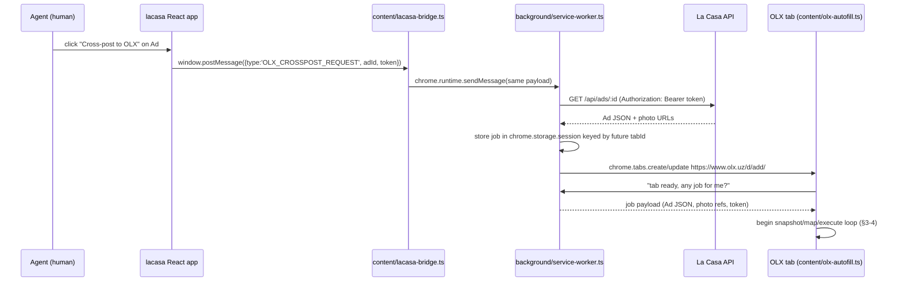

# OLX.uz Cross-posting — Browser Extension + LLM Autofill

> Detail doc for `06-cross-posting.md` §3. Read that doc first for the
> cross-channel overview; this is the full extension spec it summarizes.

Status: implemented (2026-07-30) — see `extension/` (multi-target: OLX +
Instagram fallback per `09-instagram-onboarding.md` §2, extended to full
automation), `server/src/routes/publish.js` (generic
`POST /publish/:channel/map-fields|confirm`), and `server/src/lib/llm.js`.
Deviation from this spec: ads still live in Firestore, so the web app sends
the full Ad payload with the trigger message instead of the extension
fetching `GET /api/ads/:id`, and `AdPublication.adId` is a plain string.
Extends Phase E (`05-migration-plan.md`)
with a fourth publishing channel that cannot use a server-to-server API, because
none exists for this market (see "Why not an API" below).

## Why this shape

OLX.uz has no bulk/partner posting API for Uzbekistan. Its ad-posting flow is a
client-rendered SPA behind phone-verified login. The only approach that doesn't
require storing a user's OLX session/credentials server-side (a ToS and security
liability) is: run inside the agent's **own already-logged-in browser tab**, have
an LLM read the live form and propose values, and require the human to click
**Publish** themselves. This mirrors how a careful human assistant would do it —
never a background/unattended bot. Facebook Marketplace and native IG composer
were evaluated and ruled out (no compliant automation path exists at all for
either). Telegram and Instagram-via-Graph-API stay one-click server-side flows
(`POST /publish/telegram`, `POST /publish/instagram`); YouTube stays client-side
OAuth. This doc only covers the OLX case.

---

## 1. Extension shape (Manifest V3)

Chrome Web Store policy (and MV3 itself) forbids fetching and `eval`-ing remote
JavaScript. Everything the extension runs must ship inside the packaged bundle.
The LLM call therefore returns **data only** (a JSON field-map), never a script
— the executor is fixed, bundled code that interprets that JSON; the model
cannot inject behavior beyond the fixed action vocabulary in §4.

`extension/manifest.json`:

```json
{
  "manifest_version": 3,
  "name": "La Casa — OLX Cross-poster",
  "version": "0.1.0",
  "description": "Autofills OLX.uz's ad form from a La Casa listing; you review and publish.",
  "permissions": ["storage", "scripting", "tabs"],
  "host_permissions": [
    "https://www.olx.uz/*",
    "https://olx.uz/*",
    "https://api.lacasa.uz/*",
    "https://minio.lacasa.uz/*"
  ],
  "background": {
    "service_worker": "background/service-worker.js",
    "type": "module"
  },
  "content_scripts": [
    {
      "matches": ["https://lacasa.uz/*", "https://*.lacasa.uz/*", "http://localhost:5273/*"],
      "js": ["content/lacasa-bridge.js"],
      "run_at": "document_idle"
    },
    {
      "matches": ["https://www.olx.uz/*", "https://olx.uz/*"],
      "js": ["content/olx-autofill.js"],
      "run_at": "document_idle",
      "all_frames": false
    }
  ],
  "action": { "default_title": "La Casa OLX Cross-poster" },
  "icons": { "16": "icons/icon16.png", "48": "icons/icon48.png", "128": "icons/icon128.png" },
  "content_security_policy": {
    "extension_pages": "script-src 'self'; object-src 'self'"
  }
}
```

Notes:
- `host_permissions` is scoped to exactly three origins: OLX (to run/fetch
  there), the La Casa API (to fetch Ad JSON, request field-mapping, and log
  outcomes), and the MinIO public endpoint (to fetch photo bytes). No `<all_urls>`.
- No `activeTab`-only design: we need the background worker to `fetch()`
  cross-origin without a foreground tab focused, so explicit `host_permissions`
  are used instead of relying on `activeTab`.
- `localhost:5273` is the Vite dev server match, dropped from the prod-built
  manifest via a small build-time template (`manifest.template.json` +
  `vite.config.ts` plugin that swaps the lacasa match pattern per environment).
- No `"scripting"` dynamic code injection of remote strings — `scripting`
  permission here is only used to inject the bundled, already-built
  `ui/review-banner.js`/css if we choose to inject it via
  `chrome.scripting.insertCSS` rather than a static content script (both are
  fine under MV3; static content_scripts is simpler and is what's listed above).

---

## 2. Trigger flow: lacasa app → extension → OLX tab



Details:

- **Web-app side** (`src/services/olx.ts`, new): the "Cross-post to OLX" button
  (added next to the existing TG/IG buttons in `AdsEdit`/`AdsAdd`) does a
  `postMessage` handshake, not a direct `chrome.runtime.sendMessage`. Pages
  cannot message an extension directly unless the extension declares
  `externally_connectable` with the page's origin allow-listed; we deliberately
  avoid that, because it would hardcode the extension ID into the web bundle
  across every environment (dev/staging/prod) and widen the extension's attack
  surface to *any* script that ever runs on `lacasa.uz` (e.g. an XSS bug), not
  just our own bundle. `postMessage` + a content-script relay keeps the
  extension's only entry point same-origin-scoped and lets the extension change
  its ID freely.
- The page-side call:
  ```ts
  // src/services/olx.ts
  export function requestOlxCrosspost(adId: string, token: string) {
    window.postMessage(
      { source: "lacasa-app", type: "OLX_CROSSPOST_REQUEST", adId, token },
      window.location.origin,
    );
  }

  export function pingExtension(): Promise<boolean> {
    return new Promise((resolve) => {
      const id = crypto.randomUUID();
      const onMsg = (e: MessageEvent) => {
        if (e.source !== window || e.origin !== window.location.origin) return;
        if (e.data?.type === "OLX_EXT_PONG" && e.data.id === id) {
          window.removeEventListener("message", onMsg);
          resolve(true);
        }
      };
      window.addEventListener("message", onMsg);
      window.postMessage({ source: "lacasa-app", type: "OLX_EXT_PING", id }, window.location.origin);
      setTimeout(() => resolve(false), 500);
    });
  }
  ```
  `pingExtension()` lets the UI show "Install the La Casa OLX extension"
  instead of a dead button when it isn't present.
- **`content/lacasa-bridge.ts`** (isolated-world content script on
  `lacasa.uz`): listens for `message` events, validates
  `event.source === window && event.origin === window.location.origin &&
  event.data?.source === 'lacasa-app'`, then forwards the typed payload via
  `chrome.runtime.sendMessage`. It also answers `OLX_EXT_PING` immediately
  (proves the extension is installed) without touching the background worker.
- **Background service worker**: fetches the canonical Ad JSON itself (`GET
  /api/ads/:id`) rather than trusting whatever the page sent beyond `adId` +
  `token` — keeps the payload authoritative and picks up current photos even
  if the page's in-memory state is stale. It opens (or focuses, if one is
  already open and tracked) a single OLX tab and stores the job — `{ adId,
  adJson, token, createdAt }` — in `chrome.storage.session` keyed by the tab id
  the new tab receives. `chrome.storage.session` is used (not worker-local
  variables) because MV3 service workers are killed and respawned constantly;
  in-memory state does not survive that.
- **`content/olx-autofill.ts`** on the OLX tab, on `document_idle`, asks the
  background worker "is there a job for my `chrome.runtime.id`/tab context?"
  via `chrome.runtime.sendMessage({ type: 'OLX_JOB_REQUEST' })` — the
  background worker resolves the sender's `tabId` from `sender.tab.id` and
  returns the stored job, or `null` if the tab was opened manually (in which
  case the content script stays dormant and injects nothing).

---

## 3. Field-mapping mechanism

### 3.1 DOM snapshot (not raw HTML)

`content/dom-snapshot.ts` walks the posting form's live DOM, scoped to the
current step's main container, and produces a compact accessibility-tree-style
array — labels, roles, current values, option lists — deliberately **not**
`outerHTML`, to keep the payload small (a few KB instead of hundreds) and to
strip OLX's styling/layout noise that isn't relevant to filling the form.

```ts
// content/dom-snapshot.ts
export type FieldNode = {
  ref: string;              // synthetic id, injected as data-lacasa-ref, fresh every run
  tag: "input" | "select" | "textarea" | "button" | "div";
  role?: string;             // aria role or inferred (combobox, radio, option, listbox)
  type?: string;             // input type attribute
  name?: string;
  id?: string;
  label?: string;            // <label for>, aria-label/aria-labelledby, or nearest preceding text node
  placeholder?: string;
  value?: string;            // current value / selected option text
  options?: string[];        // visible option text for select/radio-group/listbox
  required?: boolean;
  path: number[];            // shallow child-index path from the scoped root; fallback locator
};

export type CategoryStepNode = {
  ref: string;
  kind: "category-step";
  level: number;             // 0 = top level (e.g. "Недвижимость"), increments per click
  options: { ref: string; label: string }[];
};

export function snapshotStep(root: Element): (FieldNode | CategoryStepNode)[] {
  // 1. If root matches the category-picker pattern (a listbox/list of buttons
  //    with no name attribute, step 0 of /d/add/), emit a single CategoryStepNode.
  // 2. Otherwise walk root, collect input/select/textarea/[role=radio|checkbox]/
  //    submit-adjacent buttons, skip hidden/disabled/decorative wrapper divs,
  //    inject `data-lacasa-ref` on each kept element, cap at ~150 nodes.
  // 3. Resolve `label` via label[for], aria-label, aria-labelledby, then
  //    nearest preceding text sibling/ancestor as a last resort.
}
```

Every element the snapshotter keeps gets a fresh `data-lacasa-ref="f7"`
attribute so refs are stable *for the duration of this run only* — never
persisted, never assumed correct across a page reload or the next cross-post.
This is the load-bearing decision for resilience (§6): nothing hardcodes a
selector against OLX's actual DOM structure.

### 3.2 Category tree (multi-step, not a single dropdown)

OLX's category picker (Недвижимость → Квартиры → Продажа) is a sequence of
click-through panels, not a `<select>`. `content/category-picker.ts` treats it
as its own loop, separate from the flat-field loop:

1. Snapshot the current panel → single `CategoryStepNode` with this level's
   clickable options.
2. Send it to the backend (§3.3) with the Ad's `type`/`category` fields
   (RESIDENTIAL/NONRESIDENTIAL, RENT/SALE) — the backend LLM picks the option
   whose label best matches, returns `{ categoryClick: { ref, label } }`.
3. Executor clicks that option (`dom-executor.ts`, §4).
4. A bounded `MutationObserver` (5s timeout) waits for the next panel/level to
   render, or for the picker to close (leaf category reached, no more levels).
5. If a next level appeared, go to 1 with the new panel as root. If the picker
   closed, category selection is done; if the timeout fires with no change,
   abort category selection and hand off to the human via the review banner
   (§6) rather than guessing or retrying indefinitely.

Each level is its own fresh snapshot/map/click round trip — the backend is
never asked to predict the whole tree in one shot, since the tree's shape
depends on OLX's current copy and structure, which is exactly what we can't
hardcode.

### 3.3 Backend mapping endpoint

New route, alongside the existing `/publish/*` routes:

| Method & path | Access | Body | Returns |
|---|---|---|---|
| `POST /publish/olx/map-fields` | agent/coworker | `{ adId, step: "category"\|"details"\|"photos"\|"price-location", snapshot: (FieldNode\|CategoryStepNode)[] }` | `{ categoryClick?, fields: FieldAction[], unresolved: UnresolvedField[], confidence }` |
| `POST /publish/olx/confirm` | agent/coworker | `{ adId, event: "drafted"\|"published"\|"failed"\|"aborted"\|"dom-drift", externalId?, externalUrl?, errorMessage? }` | `{ publication }` — status transitions (`drafted`→`DRAFTED_AWAITING_REVIEW`, `published`/`failed` set the terminal status) plus audit-only events (`aborted`, `dom-drift`) that leave status untouched |

```ts
type FieldAction = {
  ref: string;
  action: "set-value" | "select-option" | "click-radio";
  value: string;        // text to type, or option label to select/click
  confidence: number;   // 0-1, per field
};
type UnresolvedField = { ref: string; reason: string; suggestedAdField?: string };
```

`server/src/routes/olx.js` loads the Ad (reusing the same Prisma query as
`GET /ads/:id`), builds a prompt from (a) the Ad's structured fields relevant
to a listing — title, city/district/address, type, category, rooms, area,
storey/floors, repairment, furniture, price/priceType, description,
hashtags/nearPlaces — and (b) the serialized snapshot, and calls the LLM with
a **strict JSON schema / tool-use response format** (`server/src/lib/llm.js`,
new) so the model is structurally prevented from returning anything but the
`FieldAction[]`/`UnresolvedField[]` shape — never a script, never free text.
The prompt explicitly instructs: never target an element that looks like the
final submit/publish control (see §7 for the executor-side enforcement of the
same rule — defense in depth, not prompt-level trust alone).

---

## 4. Executor: why `.value =` fails, and what works instead

OLX's form is a React SPA. React installs its change-tracking via the
*native* property setter on the DOM prototype (`HTMLInputElement.prototype`),
not on the element instance. When you do `el.value = 'x'` directly, you go
through that same native setter too — but React separately caches "the last
value I set" on an internal fiber field, and it never receives an `input`
event, so:

- its synthetic `onChange` handler never fires, so OLX's form-state store
  (Redux/Zustand/local `useState`, whatever they use) never learns about the
  new value;
- on next render React may re-assert the value it still believes is correct,
  visually snapping the field back;
- even if the text stays on screen, the value is absent from whatever payload
  OLX sends when you advance to the next step or submit.

The fix: call the native setter **and** dispatch a real `input`/`change`
event so React's synthetic event system (which listens at the document root
via delegation) observes it as a genuine user edit:

```ts
// content/dom-executor.ts
function setNativeValue(el: HTMLInputElement | HTMLTextAreaElement, value: string) {
  const proto = el instanceof HTMLTextAreaElement
    ? HTMLTextAreaElement.prototype
    : HTMLInputElement.prototype;
  const setter = Object.getOwnPropertyDescriptor(proto, "value")!.set!;
  setter.call(el, value);
  el.dispatchEvent(new Event("input", { bubbles: true }));
  el.dispatchEvent(new Event("change", { bubbles: true }));
}

function setNativeSelect(el: HTMLSelectElement, optionText: string) {
  const opt = Array.from(el.options).find(o => o.text.trim() === optionText.trim());
  if (!opt) return false;
  const setter = Object.getOwnPropertyDescriptor(HTMLSelectElement.prototype, "value")!.set!;
  setter.call(el, opt.value);
  el.dispatchEvent(new Event("change", { bubbles: true }));
  return true;
}

function clickOption(el: Element) {
  // Custom widgets (category picker, radio-styled toggles) are just click
  // handlers, not controlled inputs — no setter needed, just a real click.
  for (const type of ["pointerdown", "mousedown", "mouseup", "click"] as const) {
    el.dispatchEvent(new MouseEvent(type, { bubbles: true, cancelable: true, view: window }));
  }
}

async function applyAction(a: FieldAction) {
  const el = document.querySelector(`[data-lacasa-ref="${a.ref}"]`);
  if (!el) return { ref: a.ref, ok: false, reason: "element vanished before apply" };

  if (a.action === "set-value") setNativeValue(el as HTMLInputElement, a.value);
  else if (a.action === "select-option") setNativeSelect(el as HTMLSelectElement, a.value);
  else if (a.action === "click-radio") clickOption(el);

  await new Promise(r => setTimeout(r, 60)); // let React re-render
  const stuck = "value" in el ? (el as HTMLInputElement).value !== a.value : false;
  return { ref: a.ref, ok: !stuck, reason: stuck ? "value did not persist" : undefined };
}
```

For fields where even this doesn't stick (some custom combobox/typeahead
widgets read from `InputEvent.data` / `inputType` and ignore programmatic
`.value` entirely) fall back to simulated keystrokes per character —
`keydown` → `beforeinput`/`input` with `inputType: 'insertText', data: ch` →
`keyup` — for just that field, detected by the read-back check in
`applyAction` above (if `stuck` is true, retry once with keystroke
simulation before giving up and marking it unresolved).

---

## 5. Photo handling

OLX's file input needs a real `FileList` of `File` objects; `input.files` is
**read-only** so it can't be assigned a plain array — it must be built via
`DataTransfer`.

Fetching: MinIO photo URLs are cross-origin to OLX. The **background service
worker** fetches each photo (it has `host_permissions` for the MinIO origin
and MV3 background workers get cross-origin `fetch` without the page's CORS
context getting involved), then transfers the raw bytes to the OLX tab's
content script as an `ArrayBuffer` via `chrome.tabs.sendMessage` (structured
clone supports `ArrayBuffer`/transferables; it does **not** reliably support
`Blob` across extension contexts, so we don't try to send a `Blob` directly).
The content script reconstructs a `File` locally and builds the
`DataTransfer`:

```ts
// background/service-worker.ts
async function fetchPhotoBytes(url: string) {
  const res = await fetch(url);
  const buffer = await res.arrayBuffer();
  return { buffer, mime: res.headers.get("content-type") ?? "image/jpeg", filename: url.split("/").pop()! };
}

// content/dom-executor.ts
async function attachPhotos(input: HTMLInputElement, photos: { buffer: ArrayBuffer; mime: string; filename: string }[]) {
  const dt = new DataTransfer();
  for (const p of photos) {
    dt.items.add(new File([p.buffer], p.filename, { type: p.mime }));
  }
  input.files = dt.files;
  input.dispatchEvent(new Event("change", { bubbles: true }));
}
```

What the extension can and can't do here:
- **Can**: assign `input.files` via `DataTransfer` without a user gesture —
  this is a scripted property assignment, not opening the native OS file
  picker, so Chrome does not gate it behind `isTrusted`/user-activation the
  way it gates `input.click()`/`showPicker()`.
- **Can't**: open OLX's native file-picker dialog itself and select files
  through the OS chrome — extensions have no OS-level file-dialog automation,
  and don't need it, since the `DataTransfer` route bypasses the dialog
  entirely.
- Photos are transferred in small batches (3-4 at a time) rather than all at
  once, to keep the `chrome.tabs.sendMessage` payload bounded — OLX listings
  commonly carry 10-20 photos, and sending 20 full-resolution `ArrayBuffer`s
  in one message risks hitting practical message-size limits and makes
  failures harder to isolate to a single photo.
- Autofill (including photo attach) only ever starts from a human clicking
  "Start autofill" in the injected banner (§6/§7) — not from the tab simply
  loading — both because it's good practice to originate the whole sequence
  from a deliberate user action, and because it keeps a human anchor point
  before the extension touches anything on OLX's page.

---

## 6. Resilience — self-healing, not hardcoded

- **No persisted selectors.** Every cross-post run re-derives everything from
  a fresh snapshot (§3.1) of whatever DOM OLX serves that day. An OLX
  redesign degrades mapping *quality* (something the LLM can adapt to on the
  next request, since it's reading the live tree) rather than causing a hard
  break that needs an extension code change and Chrome Web Store review cycle.
- **Confidence threshold.** `FieldAction.confidence` (§3.3) gates
  auto-application: the executor only applies actions at `confidence ≥ 0.75`
  (configurable). Anything below that, plus everything the LLM explicitly put
  in `unresolved`, is left untouched.
- **Highlight, don't guess.** `ui/highlight.ts` draws a visible outline +
  tooltip on every low-confidence/unresolved field: *"Suggested: rooms = 3 —
  couldn't confirm this maps to OLX's 'Комнаты' field, please check."* The
  human fills or corrects it manually; the extension never silently picks a
  value it isn't confident about.
- **Read-back verification.** `applyAction` (§4) re-reads the DOM after every
  write and reports `ok: false` if the value didn't persist — those fields are
  escalated into the same highlight list as unresolved fields, even though the
  LLM was confident, because the DOM is the ground truth.
- **Bounded waits, graceful abort.** Category-step transitions and any
  "wait for the SPA to re-render" moment use a `MutationObserver` with a hard
  timeout (5s). On timeout: stop, don't retry in a loop, surface a banner
  message ("Couldn't confirm the category changed — please continue manually
  from here") and leave the rest of the run available to resume once the
  human intervenes.
- **Drift telemetry.** A structural hash (labels + roles + tag names, not
  values) of each step's snapshot is compared against the previous run's hash
  (stored in `chrome.storage.local`, not sent anywhere by default). On a
  significant diff, `POST /publish/olx/confirm { adId, event: 'dom-drift' }`
  fires once, giving the team a low-noise signal that OLX changed its form —
  useful for noticing systemic mapping-quality drops before agents complain.

---

## 7. Guardrails

- **Never auto-click Publish.** The executor's action vocabulary
  (`set-value`, `select-option`, `click-radio`, `category-click`,
  `attach-photos`) has no "submit" action at all — it structurally cannot
  click Publish even if a compromised or hallucinating LLM response asked it
  to. Defense in depth: (1) the backend prompt instructs the model to never
  target the submit/publish control; (2) the executor independently refuses
  to act on any `ref` whose element is `type="submit"`, has `form` submit
  semantics, or whose accessible name matches a submit-button heuristic
  ("Опубликовать" / "Publish" / "Joylashtirish"), regardless of what a
  response says.
- **"Review before publishing" banner.** `ui/review-banner.ts` injects a
  fixed-position, shadow-DOM-isolated banner (avoids OLX's CSS bleeding in
  or out) once a step's autofill completes: *"La Casa autofilled 11 of 13
  fields. 2 fields need your review (highlighted below). Check the photos and
  price, then click Publish yourself."* It persists across the rest of the
  session until dismissed.
- **Per-agent daily rate limit, enforced server-side.** Every `POST
  /publish/olx/map-fields` call with `step: "category"` marks the start of a
  new session (it's the first request per run); the handler counts those
  calls for the authenticated agent in the last 24h against a cap (default
  15/day, configurable) and returns `429` past it. This is enforced in the
  backend specifically so it can't be bypassed by reinstalling the extension
  or clearing local storage — only a server-held counter is trustworthy.
- **One session at a time, with cooldown.** The background worker refuses to
  open a second OLX autofill tab while one job is in flight, and enforces a
  minimum cooldown (default 3 minutes, `chrome.storage.local`) between
  completed cross-posts before the "Cross-post to OLX" button reactivates.
  Combined with the daily cap, this keeps posting cadence looking like normal
  human activity and avoids resembling OLX's near-duplicate/spam detection
  patterns (rapid, identical-looking listings from one account in a short
  window). No batch/queue mode is offered — each cross-post is one Ad, one
  human review, one deliberate Publish click; the design has no unattended
  bulk-posting path even in principle.

---

## 8. Monorepo placement

New top-level `extension/` directory, sibling to `server/` and `src/`:

```
extension/
  manifest.json                 # or manifest.template.json, env-swapped at build time
  package.json
  tsconfig.json
  vite.config.ts                # bundles background + content scripts + banner CSS -> extension/dist
  README.md
  icons/
    icon16.png  icon48.png  icon128.png
  src/
    background/
      service-worker.ts         # entry: message routing, job store, tab lifecycle
      olx-tab-manager.ts        # tracks pending jobs keyed by tabId in chrome.storage.session
      api-client.ts             # fetch wrapper for the La Casa API (auth header, base URL per env)
      photo-fetcher.ts          # fetches MinIO photo bytes, batches transfer to content script
    content/
      lacasa-bridge.ts          # runs on lacasa.uz — postMessage <-> chrome.runtime relay + ping
      olx-autofill.ts           # runs on olx.uz — orchestrates snapshot/map/execute per step
      dom-snapshot.ts           # accessibility-tree-style serializer (§3.1)
      category-picker.ts        # multi-step category click-through loop (§3.2)
      dom-executor.ts           # native setter, event dispatch, click sequencer, photo attach (§4-5)
    ui/
      review-banner.ts          # shadow-DOM banner, injected after each step (§7)
      review-banner.css
      highlight.ts              # per-field outline + tooltip for low-confidence/unresolved fields
    lib/
      types.ts                  # AdJson / FieldAction / snapshot types, mirrored from server DTOs
      messaging.ts              # typed chrome.runtime/tabs message contracts
```

Backend additions (documented here, implemented under Phase E follow-up):

- `server/src/routes/olx.js` — `POST /publish/olx/map-fields`,
  `POST /publish/olx/confirm` (see §3.3).
- `server/src/lib/llm.js` — LLM client wrapper issuing the field-mapping call
  with an enforced JSON response schema.
- Prisma: either a new `event_type` pair (`OLX_CROSSPOST_STARTED`,
  `OLX_CROSSPOST_COMPLETED`, `OLX_CROSSPOST_ABORTED`) on the existing
  `activity_events` table (reusing `03-data-model.md`'s pattern — it already
  has `agent_id`, `ad_id`, `meta jsonb`), or a small dedicated
  `olx_crosspost_log` table if per-post outcome detail grows beyond what
  `meta jsonb` comfortably holds. Reusing `activity_events` is the simpler
  default and keeps the daily-rate-limit query (`count where agent_id = ? and
  type = 'OLX_CROSSPOST_STARTED' and created_at > now() - interval '1 day'`)
  consistent with how the rest of the dashboard already queries this table.

Frontend addition:

- `src/services/olx.ts` — the postMessage handshake + extension-presence
  ping (§2).
- `AdsEdit`/`AdsAdd` — a "Cross-post to OLX" button next to the existing
  TG/IG cross-post controls, disabled with an install-prompt when
  `pingExtension()` resolves `false`.
